# ダイレクトアクセス
## 変化量可視化
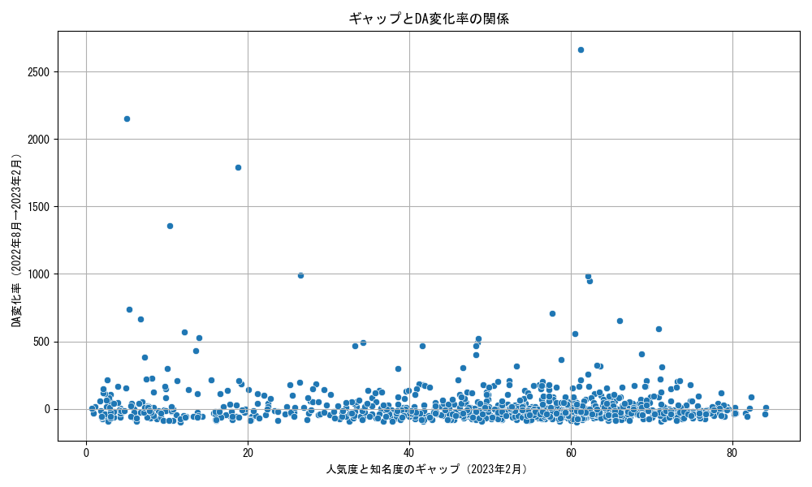
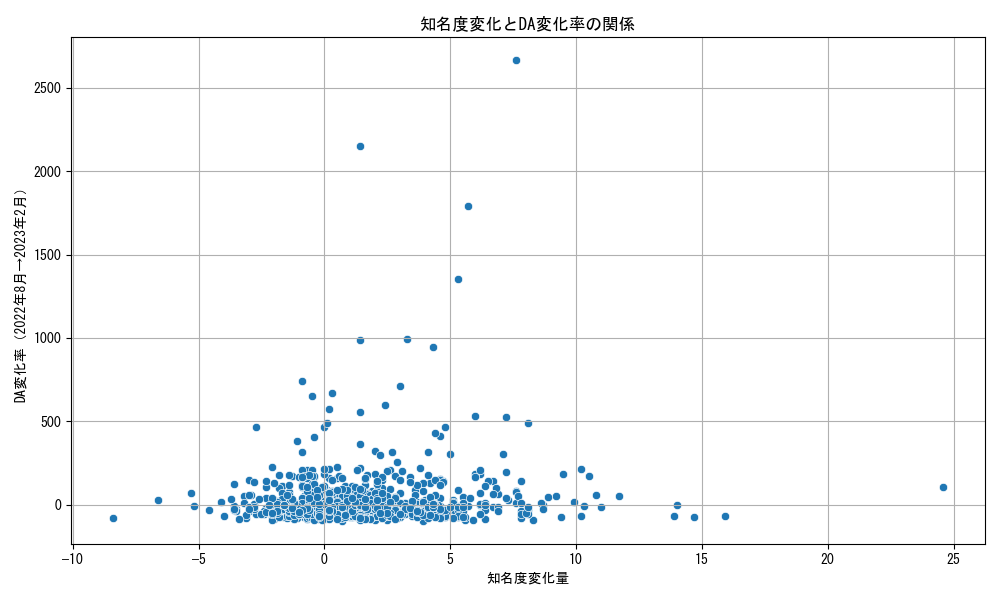
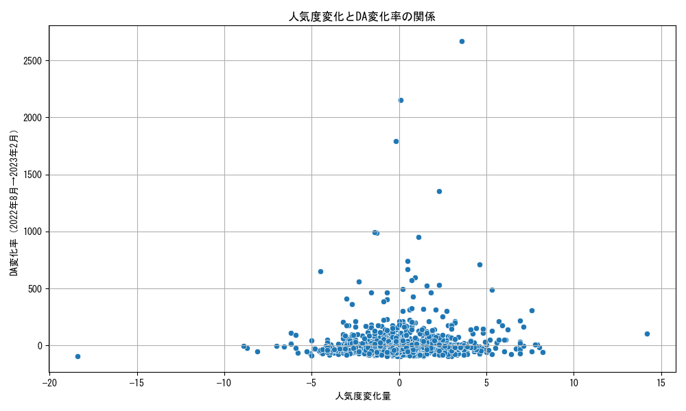
## 時系列推移
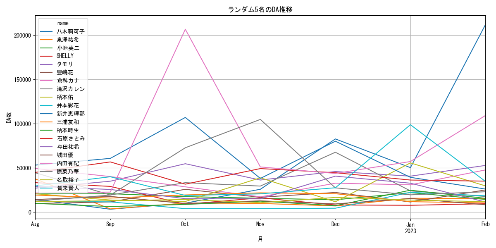
## 相関行列ヒートマップ

## トレンド検出
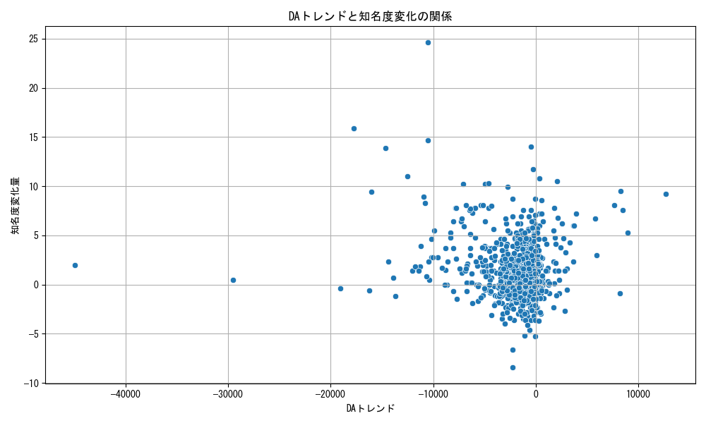
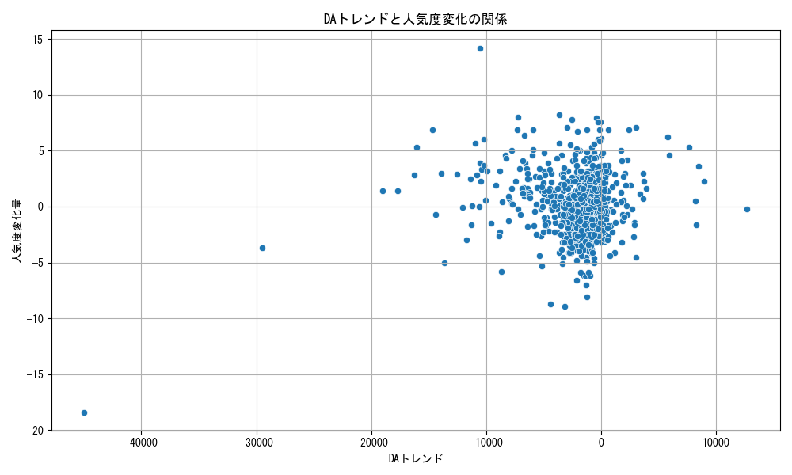
## トレンド傾きとの相関
```
DAトレンド傾き      1.000000
202208ギャップ    0.032840
202302ギャップ    0.009740
202208知名度    -0.038901
202302知名度    -0.053368
202302人気度    -0.151541
202208人気度    -0.157285
ギャップ変化量      -0.164931
```
# ブラウズランク
## 変化量可視化
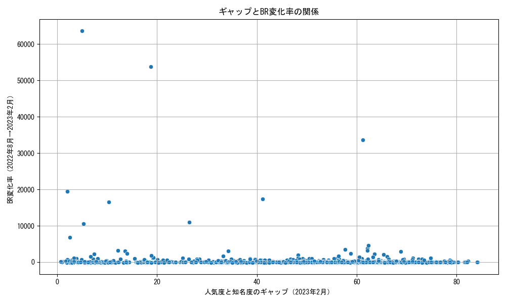
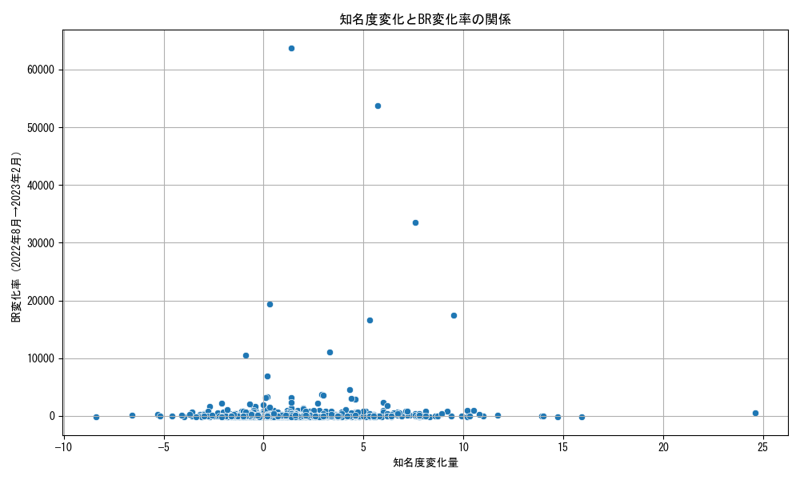
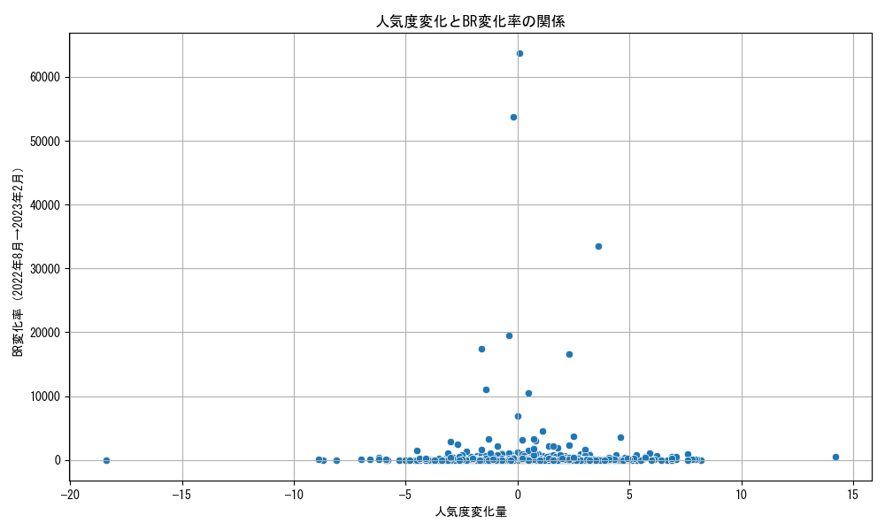
## 時系列推移
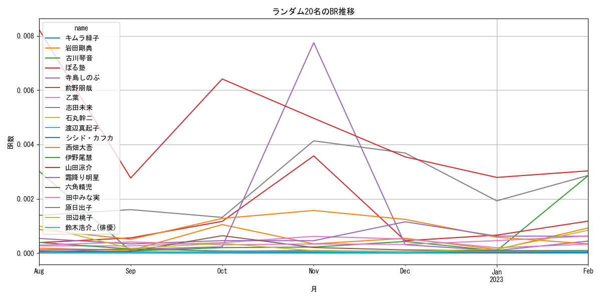
## 相関行列ヒートマップ
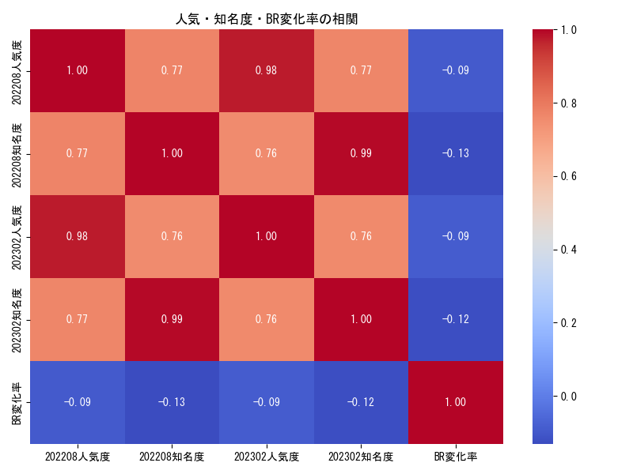
## トレンド検出

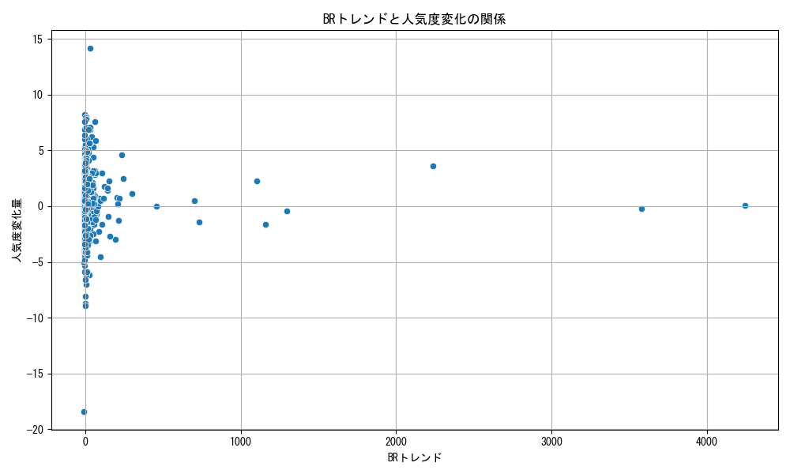
## トレンド傾きとの相関
```
BRトレンド傾き      1.000000
ギャップ変化量       0.066194
202302人気度    -0.089350
202208人気度    -0.092558
202302ギャップ   -0.119118
202302知名度    -0.124226
202208ギャップ   -0.127929
202208知名度    -0.131285
```
# ランダムフォレストによるクラスタリング
## DA
```
分類レポート:
               precision    recall  f1-score     support
HH             0.507463  0.576271  0.539683  118.000000
HL             0.333333  0.142857  0.200000   28.000000
LH             0.076923  0.035714  0.048780   28.000000
LL             0.500000  0.564103  0.530120  117.000000
accuracy       0.477663  0.477663  0.477663    0.477663
macro avg      0.354430  0.329736  0.329646  291.000000
weighted avg   0.446281  0.477663  0.455919  291.000000
```
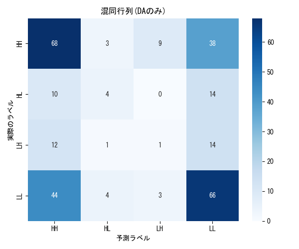
## DA & BR
```
分類レポート:
               precision    recall  f1-score     support
HH             0.539007  0.644068  0.586873  118.000000
HL             0.000000  0.000000  0.000000   28.000000
LH             0.125000  0.035714  0.055556   28.000000
LL             0.528986  0.623932  0.572549  117.000000
accuracy       0.515464  0.515464  0.515464    0.515464
macro avg      0.298248  0.325928  0.303744  291.000000
weighted avg   0.443279  0.515464  0.473521  291.000000
```
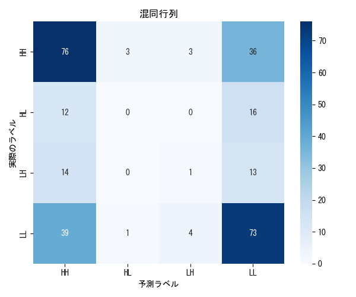
