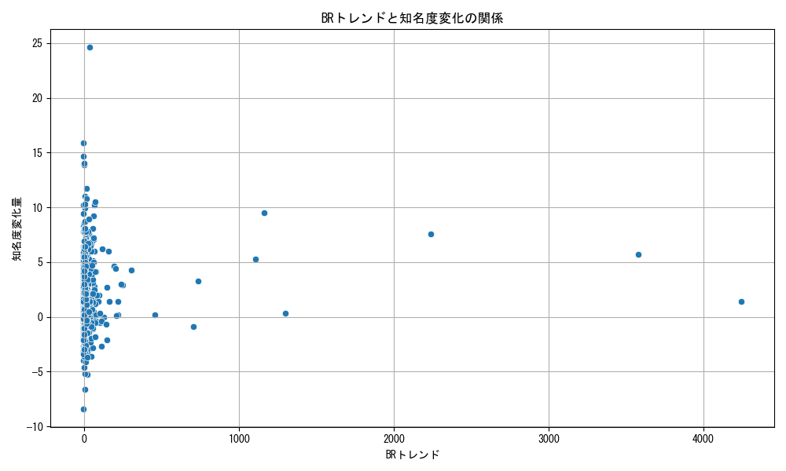

# ダイレクトアクセス
## 変化量可視化


## 時系列推移

## 相関行列ヒートマップ

## トレンド検出


## トレンド傾きとの相関
```
DAトレンド傾き      1.000000
202208ギャップ    0.032840
202302ギャップ    0.009740
202208知名度    -0.038901
202302知名度    -0.053368
202302人気度    -0.151541
202208人気度    -0.157285
ギャップ変化量      -0.164931
```
# ブラウズランク
## 変化量可視化


## 時系列推移

## 相関行列ヒートマップ

## トレンド検出


## トレンド傾きとの相関
```
BRトレンド傾き      1.000000
ギャップ変化量       0.066194
202302人気度    -0.089350
202208人気度    -0.092558
202302ギャップ   -0.119118
202302知名度    -0.124226
202208ギャップ   -0.127929
202208知名度    -0.131285
```
