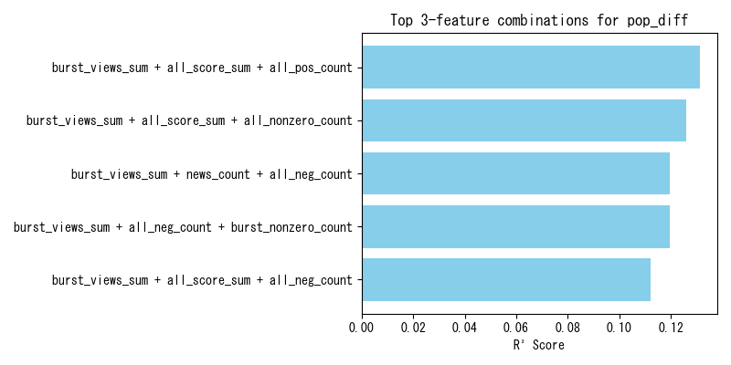
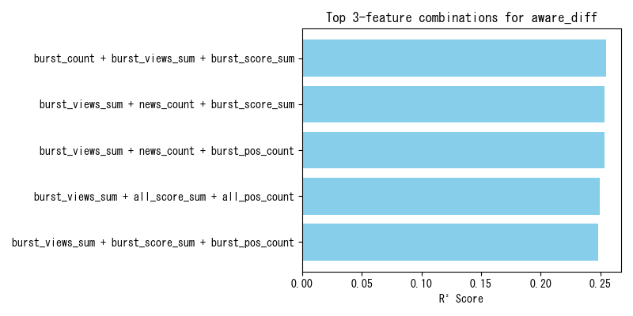

# インターネット上のデータからの人物の人気度及び知名度の推定
### Estimating Individuals’ Popularity and Name Recognition from Internet Data  
ソーシャルメディアユニット
平尾 喜洋 / Yoshihiro Hirao  

---

## 研究目的
- テレビタレントの **知名度・人気度・それらの変化量** を推定  
- データ：インターネット（Wikipedia, ニュースなど）  
- 従来の質問調査法に依らない推定  
- 応用先：キャスティング最適化、広告効果測定、学術的分析  

---

## 定義
- **知名度 (Awareness)**  
  $$
  \text{知名度} = \frac{\text{そのタレントを知っている人数}}{\text{調査対象者数}}
  $$  

- **人気度 (Popularity)**  
  $$
  \text{人気度} = \frac{\text{「非常に好き」または「やや好き」と回答した人数}}{\text{調査対象者数}}
  $$  

---

## 使用データセット
- **タレントリサーチ (Video Research)**  
  - 2022年7月, 2023年1月の人気度・知名度調査  
- **Wikipedia Clickstream (2022/8〜2023/1)**  
  - Wikipediaのページ間遷移数を記録  
- **Wikipedia Page View数 (2022/8〜2023/1)**  
  - 各タレントのWikipediaページの日次アクセス数  
- **ニュースリスト (2022/8〜2023/1)**  
  - タレント名を含むニュースをGNews APIで収集、 全152,261件

---

## 手法① Wikipedia Clickstreamを用いた推定
知名度（人気度）の高い人物から低い人物にアクセスが流れやすいという仮定のもと、複数の手法を適用
- **レイティング手法**
  - スポーツチームにおけるレイティング手法をWikipedia Clickstreamのデータに適用できるよう改良
- **PageRank**
  - ウェブページの重要度を測る指標PageRankをWikipedia Clickstreamのデータに適用できるよう改良
- **BrowseRank**
  - ウェブページの重要度を測る指標BrowseRankをWikipedia Clickstreamのデータに適用できるよう改良

---

## レイティング手法
Massey、Colley、Keenerのレイティング手法をWikipedia Clickstreamに適用できるよう改良

これらの手法は本来スポーツチームの順位付けで用いられるもので、Wikipediaにおけるリンク構造とClickstreamを右図のように見なす

---

<!-- _footer: "Massey (1997), Statistical models applied to the rating of sports teams, Bluefield College" -->

### Masseyのレイティング手法（改良版）
レイティングベクトル$r$を求める   
- $(m_{ij})$は本来各チーム間の試合数を表す行列
- $p$ は本来各チームの累積得点差を表すベクトル
$$
m_{ij} =
\begin{cases}
\text{リンク数} & (i = j) \\
0 & (i, j にリンクなし) \\
-1 & (i, j にリンクあり)
\end{cases}
$$

$$
p_i = \sum_j \big( \text{アクセス数}(i \to j) - \text{アクセス数}(j \to i) \big)
$$

$$
(m_{ij}) r = p
$$

---

<!-- _footer: "Colley (2002), Colley’s bias free college football ranking method, Princeton University" -->

### Colleyのレイティング手法（改良版）
レイティングベクトル$r$を求める
- $(m_{ij})$は本来各チーム間の試合数を表す行列
- $b$ は本来各チームの累積勝敗差を表すベクトル
$$
m_{ij} =
\begin{cases}
\text{リンク数} + 2 & (i = j) \\
0 & (i, j にリンクなし) \\
-1 & (i, j にリンクあり)
\end{cases}
$$

$$
b_i = \sum_j 
\begin{cases}
1 & \big(\text{アクセス数}(i \to j) > \text{アクセス数}(j \to i)\big) \\
0 & \text{otherwise}
\end{cases}
$$

$$
(m_{ij}) r = b
$$

---

<!-- _footer: "Keener (1993), The Perron–Frobenius theorem and the ranking of football teams, SIAM Review" -->

### Keenerのレイティング手法（改良版）
- $(a_{ij})$は本来得点率を表す行列
$$
a_{ij} = \frac{\text{アクセス数}(i \to j) + 1}{\text{アクセス数}(i \to j) + \text{アクセス数}(j \to i) + 2}
$$

行列($a_{ij}$)の固有値問題に帰着 → レイティング算出  
&nbsp;  
### レイティング手法を適用する問題点
記事間にリンクが張られているタレント群でしか計算できず、単にWikipediaに記事が存在するタレント数よりも分析できる数が大幅に減ってしまう

---

<!-- _footer: "Page et al. (1999), The PageRank citation ranking: Bringing order to the web, Stanford InfoLab" -->

## PageRank（有向重み付き版）
- **基本モデル**
  - ランダムサーファーモデルを導入  
  - ダンピング係数 $d=0.85$  

$$
\pi^{(t+1)}(i) = \frac{1-d}{N} + d \sum_{j \in M(i)} \frac{\pi^{(t)}(j)}{L(j)}
$$

- **本研究での改良**
  - Wikipedia Clickstreamに対応  
  - リンクに重みとしてClickstreamまたはその逆数を正規化したものを付与  

$$
\pi^{(t+1)}(i) = \frac{1-d}{N} + d \sum_{j \in M(i)} \pi^{(t)}(j) \cdot w_{ji}
$$

---

<!-- _footer: "Liu et al. (2008), BrowseRank: Letting web users vote for page importance, SIGIR" -->

## BrowseRank（改良版）
- **ユーザ行動をマルコフモデルで表現**  

### 滞在時間の仮定
$$
f_i(t) = \theta_i e^{-\theta_i t}
$$

### Q行列
$$
q_{ij} = \theta_i P_{ij}, \quad (i \neq j)
$$
$$
q_{ii} = -\theta_i
$$

### 定常分布
$$
\pi Q = 0
$$

---

<!-- _footer: "Liu et al. (2008), BrowseRank: Letting web users vote for page importance, SIGIR" -->

### BrowseRank：DMCへの変換
連続時間マルコフ過程は扱いが複雑 → **離散時間マルコフ連鎖（DMC）** へ変換  

#### ステップ1：ダミーノードの追加
- セッション終了やジャンプ先不明を吸収するノード  

#### ステップ2：遷移確率行列の構築
$$
P_{ij} = \frac{N_{ij}}{N_i}
$$
- $N_{ij}$：ページ $i$ から $j$ への遷移回数  
- $N_i$：ページ $i$ からの遷移総数  

#### ステップ3：定常分布の計算
$$
\tilde{\pi} = \tilde{\pi} P
$$

---

<!-- _footer: "Liu et al. (2008), BrowseRank: Letting web users vote for page importance, SIGIR" -->

#### ステップ4：BrowseRankの算出
$$
\pi_i = \frac{1}{\theta_i} \tilde{\pi}_i \Big/ \sum_j \frac{1}{\theta_j} \tilde{\pi}_j
$$
- $\theta_i$: ページ $i$ の滞在率（逆数が平均滞在時間）
&nbsp;  
&nbsp;  
- **本研究での改良**  
  - Wikipedia Clickstreamに対応
  - 遷移率をClickstreamの逆数で正規化  
  - 疑似ノード導入  
  - DirectAccess数を滞在時間として利用  

---

## 実験結果（Clickstream）
- レイティング手法：全体的に精度が低い  
- PageRank：順位相関に関してはDirectAccessより精度が高い  
- BrowseRank：順位相関、相関共にDirectAccessより精度が高い

  
  

---

## 手法② ニュースを用いた推定
### バースト検出
- 判定条件  
$$
\text{その日のPV} > 2 \times \text{直近7日平均PV}
$$

### ニュースの影響度（インパクトスコア）
- 各記事タイトルに対して $-5 \sim +5$ のスコア  
- Gemini 2.0 Flashで算出  

**この手法の問題点**
- 内容が全く分からないようなタイトルのニュースが存在
- LLMは知名度の低いタレントに関するスコアリングの精度が低い

---

## 特徴量抽出
ここでのニュースとは、各タレントの名前を含むニュース
- 各調査時点の人気度/知名度
- 人気度変化/知名度変化
- 期間内に起きたバーストの件数 
- バーストした日のPage View数合計  
- バースト当日と前日に発行されたニュース数合計 
- 期間内に発行された全ニュース数合計
- バースト下ニュースのインパクトスコア合計
- 期間内全ニュースのインパクトスコア合計
- インパクトスコア正のニュース数/インパクトスコア負のニュース数  

---

## 実験結果（ニュース）

<small>
代表的な相関関係をピックアップ

- **バースト件数** - **人気度・知名度**：
  - 相関ほぼなし
- **バースト下ニュース数** - **人気度**：
  - 知名度よりも高い相関  
- **バーストPV数合計** - **人気度変化・知名度変化**：
  - 特に知名度変化と正の相関  
- **期間内全ニュース数** - **人気度・知名度**：
  - 特に知名度と正の相関
- **インパクトスコア合計** - **人気度変化・知名度変化**：
  - 正の相関  
- **ネガティブニュース数** - **人気度変化**：
  - 弱い負の相関 

</small>

---

## 線形回帰分析
- 説明変数3つの組合せで回帰  
- $R^2$スコア上位5組を比較  

結果：  
- 人気度推定 → バースト件数が重要  
- 知名度推定 → ニュースインパクトスコアが重要  
- 人気度変化 → バースト規模＋ニュースインパクトスコアが重要 
- 知名度変化 → バースト規模が重要 

---

## 今後の展望
1. ニュースの影響度をLLM以外で推定  
   - コメント数, PV数, 感情分析など  
2. バーストの種類を判別（ポジティブ/ネガティブ）  
3. 短期関心 vs 長期関心の二軸でバースト検出  
4. 人気度と知名度のギャップ分析  
5. YouGovデータの利用による国際比較  

---

## 結論
- Wikipedia Clickstream  
  - レイティング・PageRank・BrowseRankを適用  
  - しかし全体的に精度は限定的  
- ニュース＋バースト＋LLMスコア  
  - 人気度推定：バースト件数が重要  
  - 知名度推定：ニュース影響度が重要  
  - 変化推定：バースト規模＋ニュース数・スコア  
- 今後は手法の改良とデータ拡張により精度向上を目指す  

---

## Appendix

---

## Appendix

---

## Appendix

---

## Appendix

---

## Appendix

---

## Appendix

---

## Appendix

---

## Appendix

---

## Appendix

---

## Appendix

---

## Appendix

---

## Appendix

