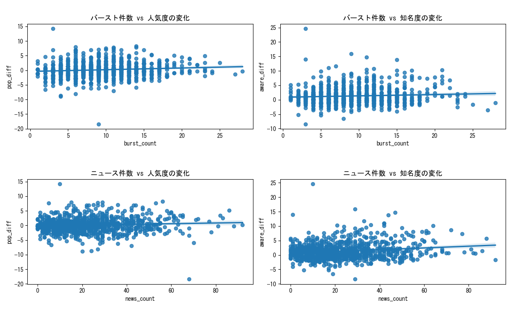

```
相関係数（バースト件数と人気度・知名度の変化）
             burst_count  news_count  pop_diff  aware_diff
burst_count     1.000000    0.590693  0.105427    0.072941
news_count      0.590693    1.000000  0.079415    0.172033
pop_diff        0.105427    0.079415  1.000000    0.408755
aware_diff      0.072941    0.172033  0.408755    1.000000
```
