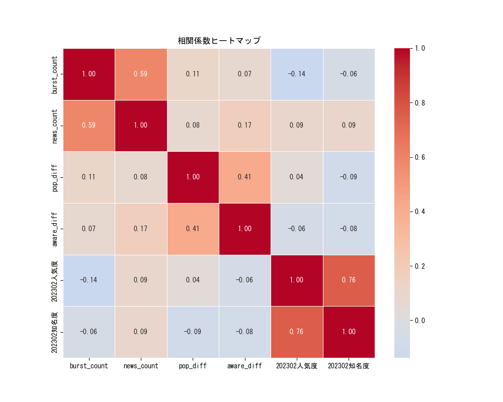

# GNEWS上限30

## ニュース分析

- [三次元プロット(変化量)](https://flatp.github.io/search/3d_scatter.html)
- [三次元プロット(絶対値)](https://flatp.github.io/search/3d_scatter.html)


## バースト分析


```
相関係数（バースト件数と人気度・知名度の変化）
             burst_count  news_count  pop_diff  aware_diff  202302人気度  202302知名度
burst_count     1.000000    0.590693  0.105427    0.072941  -0.138030  -0.060392
news_count      0.590693    1.000000  0.079415    0.172033   0.091810   0.093470
pop_diff        0.105427    0.079415  1.000000    0.408755   0.038499  -0.085171
aware_diff      0.072941    0.172033  0.408755    1.000000  -0.063002  -0.081862
202302人気度      -0.138030    0.091810  0.038499   -0.063002   1.000000   0.759909
202302知名度      -0.060392    0.093470 -0.085171   -0.081862   0.759909   1.000000
```



# GNEWS上限100

## バースト分析


```
相関係数（バースト件数と人気度・知名度の変化）
             burst_count  news_count  pop_diff  aware_diff  202302人気度  202302知名度
burst_count     1.000000    0.406335  0.105427    0.072941  -0.138030  -0.060392
news_count      0.406335    1.000000  0.110294    0.210736   0.243675   0.138223
pop_diff        0.105427    0.110294  1.000000    0.408755   0.038499  -0.085171
aware_diff      0.072941    0.210736  0.408755    1.000000  -0.063002  -0.081862
202302人気度      -0.138030    0.243675  0.038499   -0.063002   1.000000   0.759909
202302知名度      -0.060392    0.138223 -0.085171   -0.081862   0.759909   1.000000
```

## PV数の推移と変化数


## 回帰モデルの比較と精度

```
LinearRegression	線形回帰
Ridge / Lasso	正則化付き線形回帰
HuberRegressor	Huber回帰
SVR	サポートベクター回帰
RandomForestRegressor	ランダムフォレスト回帰
GradientBoostingRegressor	勾配ブースティング回帰木
```

### ニュース数、バースト数、バースト元でのニュース数


### ニュース数、バースト数、バースト元でのニュース数、元の数値


