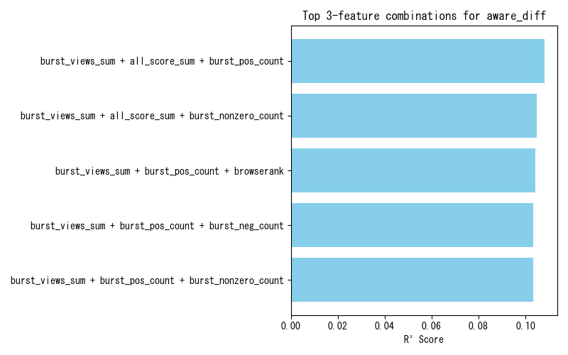

# 回帰

## ランダムフォレスト回帰
### 基本情報

### 元の数値を特徴量に追加

### PR,BRを特徴量に追加

### y対数変換

### スコア及びPV数対数変換

### スコア及びPV数及びy対数変換

## 線形回帰
### 基本情報

### y対数変換

### スコア及びPV数対数変換

### スコア及びPV数及びy対数変換

# Publisherスコアを追加
- pub_score1 ... バースト日数/発行ニュース数
- pub_score2 ... バーストPV数合計/発行ニュース数
- pub_score3 ... バースト下ニュース数/発行ニュース数
これら累計スコアをタレントごとに算出し特徴量に追加

## ランダムフォレスト回帰

### y対数変換

## 線形回帰

### y対数変換

# PVに時系列減衰を追加
- weightedPV1 ... $\frac{1.84}{(log_{10} t)^{1.25} + 1.84}$ (エビングハウスの忘却曲線)
- weightedPV2 ... $\frac{1.84}{(log_{10} d)^{1.25} + 1.84}$
- weightedPV3 ... $e^{-0.05 d}$
- weightedPV4 ... $e^{-0.4 d}$
- weightedPV5 ... $e^{-0.4 d} + d^{-0.3}$ (Two-Phase Collective Memory Decay Model)

## バースト時のPVのみ可算

## 2022年8月の数値を追加

# バーストの確認

# 精度評価の関連研究について

## Webコンテンツの人気予測に関する調査研究
chrome-extension://efaidnbmnnnibpcajpcglclefindmkaj/https://www.research-collection.ethz.ch/server/api/core/bitstreams/4d524801-7c13-4e7e-98af-1a75ef33b1e7/content
### 予測手法
- 対数変換線形回帰モデル(Log-linear model): 対数変換された線形回帰モデルで、DiggのストーリーやYouTubeの動画など、様々なデータセットで良好な予測性能を示す
- 生存分析(Survival analysi): コンテンツが一定期間後も引き続き注目を集めるかどうかを予測、Cox比例ハザード回帰モデルを使用し、イベントを「ウェブコンテンツが特定のしきい値を超える人気値に達する時間」として定義
- ロジスティック回帰(Logistic regression)： Twitterの投稿のリツイート数の予測を多クラス分類タスクとして扱い、ロジスティック回帰分類関数を使用して、リツイートされないメッセージや10,000回以上リツイートされるメッセージを正確に予測できることを示した
- 多変量線形回帰(Multivariate linear regression): 一定の期間でサンプリングされた人気度の履歴ベクトルを使用して、YouTube動画の将来の人気を予測する手法、一定のスケーリングモデルと比較して、平均14%の改善を示した
- 時系列予測モデル(Time series prediction model)/ ARMAモデル: 長期間人気のある動画について、日次の視聴回数を自己回帰移動平均（ARMA）モデルを通じてモデリングできることを発見
- kSAIT(top-k Similar Author-Identical historic Tweets): ツイートの作者に基づいてツイートが同様の方法でリツイートされるという仮定の下、ユーザー固有の予測関数を訓練し、過去の類似したツイートから人気度を推定するアルゴリズム
  
### 評価指標
- 線形関連度:
  - ニュース記事の正確な人気（ツイート数）を予測することは、大きな誤差を伴う傾向がある（ $R^2=0.34$ ）
- 二乗誤差に基づく指標:
  - 平均二乗誤差 (Mean Squared Error, MSE): 二乗誤差の平均を報告
  - 二乗平均平方根誤差 (Root Mean Squared Error, RMSE): MSEの平方根をとることで、推定値と同じ次元で誤差を表現
  - MSEの制約: 二乗誤差は外れ値の影響を過度に重視する
- 絶対誤差に基づく指標:
  - 平均絶対誤差 (Mean Absolute Error, MAE): 外れ値の影響が大きい場合に有効な代替手段
  - 絶対誤差は、実際の人気の値の範囲が分かっている場合にのみ意味をもって解釈できる
- 相対誤差に基づく指標:
  - 平均相対誤差 (Mean Relative Error, MRE): 相対誤差を表現する方法。
  - 平均相対二乗誤差 (Mean Relative Squared Error, MRSE): 相対誤差を二乗して平均を求めたもの
  - 相対的尺度の有用性: 人気の値の範囲が大きく異なる研究間（例：YouTubeの視聴回数とニュースウェブサイトのコメント数）で予測アルゴリズムの効率を比較するのに役立つ

## オンライン動画の視聴回数を予測するための回帰分析手法
chrome-extension://efaidnbmnnnibpcajpcglclefindmkaj/https://arxiv.org/pdf/1510.06223

予測の正確さを示す主要な指標としてスピアマン順位相関係数が用いられている

## ソーシャルメディアにおけるニュースの鼓動：人気予測
https://www.researchgate.net/publication/221661401_The_Pulse_of_News_in_Social_Media_Forecasting_Popularity
### 予測手法
| 変数名 | 特徴量の説明 | 詳細 | 
|:--|:--|:--|
| S | Source t-density score（発信元スコア） | 過去のTwitterでの成功に基づき、発信元（ニュースソース）ごとに割り当てられた、記事あたりの平均ツイート数（t-density） | 
| C | Category t-density score（カテゴリスコア） | 記事が属するカテゴリ（例：政治、スポーツなど）の過去の人気傾向を示す、記事あたりの平均ツイート数（t-density） | 
| Subj | Subjectivity（主観性） | 記事の言語が主観的であるか客観的であるかに基づくバイナリ値（0または1） | 
| Entct | Named entities（固有名詞の数） | 記事内（タイトルと要約）で言及されている固有名詞（場所、人物、組織）の数 | 
| Entmax | Named entities（最大スコア） | 記事内のすべての固有名詞の中で最も高いt-densityスコア | 
| Entavg | Named entities（平均スコア） | 記事内の固有名詞の平均t-densityスコア | 
  
### 評価指標
- 記事が「低ツイート」「中ツイート」「高ツイート」のどの人気クラスに属するかを予測する分類アルゴリズム

| 手法 | 精度 (Accuracy) | 
|:--|:--|
| Bagging | 83.96% |
| J48 Decision Trees | 83.75% |
| SVM | 81.54% |
| Naive Bayes | 77.79% |

- ツイートの正確な値（対数変換後）を予測する回帰アルゴリズム

| 回帰手法 | 対象データ | R²値 |
|:--|:--|:--|
| 線形回帰 (Linear Regression) | 全データ | 0.34 |
| SVM回帰 (SVM Regression) | 全データ | 0.32 |
| 線形回帰 (Category-specific) | テクノロジーカテゴリのみ | 0.43 |
| KNN回帰 (K=7, K=3) | 10kテストセット | 0.05 |

