# 元の数値で分ける

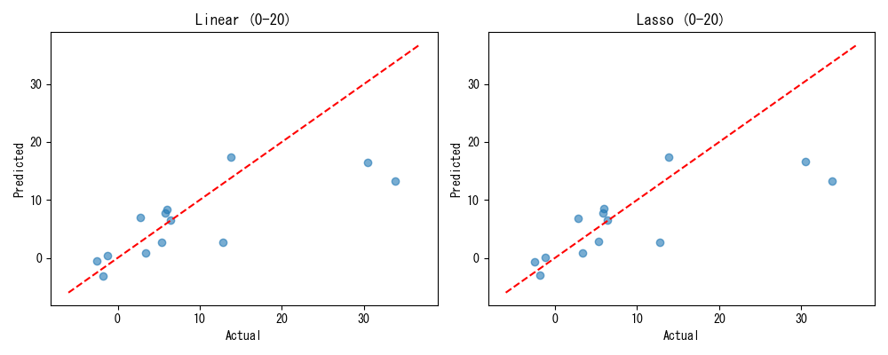
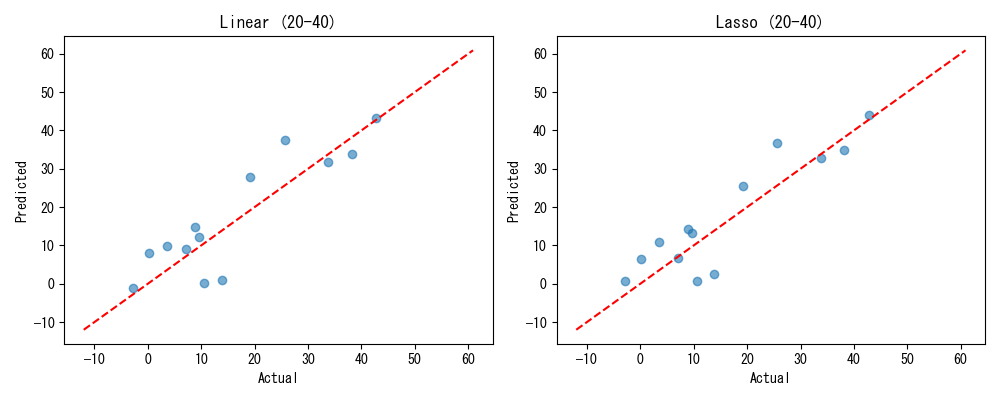
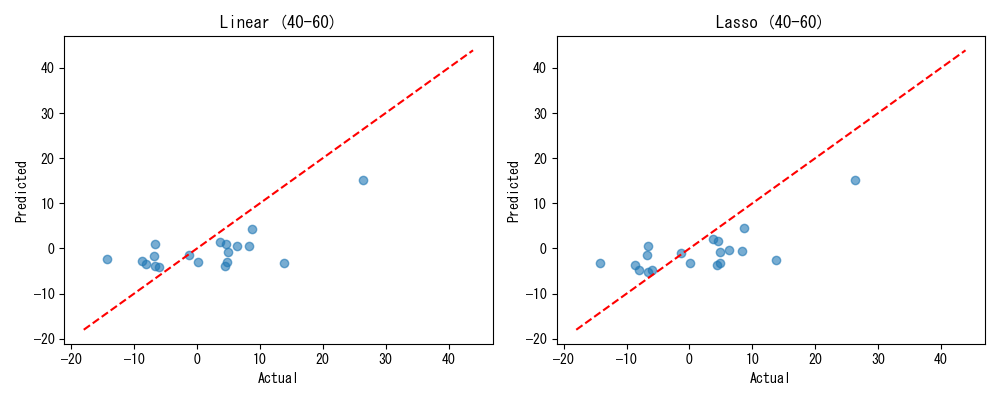
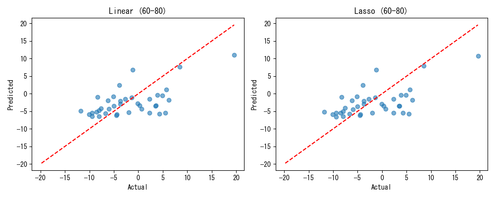
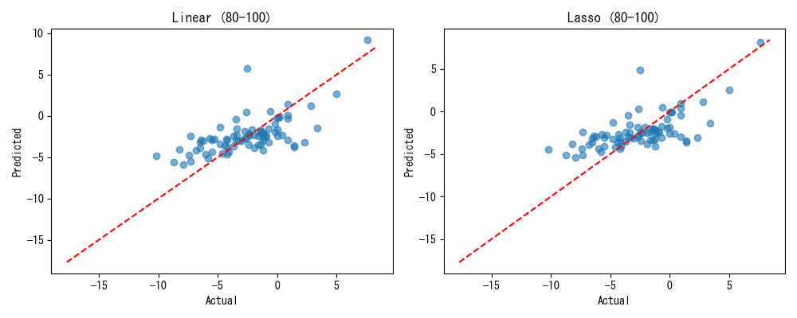

```
============================================================
201902知名度レンジ: 0–20
============================================================
データ数: 62

[Linear Regression]
R2   : 0.5050394466233077
RMSE : 7.748495578259053
MAPE : 0.6506812486001833
MRE  : 0.15199070158671726
Coef : [-2.10023946e+01 -8.87024857e-03  2.80034317e-04]
Intercept: 5.148959500625828

[Lasso Regression]
R2   : 0.5099308026081933
RMSE : 7.710113981937226
MAPE : 0.6150926073886429
MRE  : 0.13457907680363815
Intercept: 4.333974598606659
Non-zero Coef:
100-201902知名度::                         -19.176248
log(100-201902知名度)*weightedPV1_past::    -0.009595
(100-201902知名度)*weightedPV1_past::        0.000296
dtype: float64

============================================================
201902知名度レンジ: 20–40
============================================================
データ数: 61

[Linear Regression]
R2   : 0.7435853587392389
RMSE : 7.152596508251484
MAPE : 3.5663743930807836
MRE  : -3.1534203394733074
Coef : [-2.92771284e+02 -2.88120336e-03  1.32786043e-04]
Intercept: 172.3689210753859

[Lasso Regression]
R2   : 0.7883126567926495
RMSE : 6.498898626262331
MAPE : 2.913335767886193
MRE  : -2.426933180686741
Intercept: -4.103552791318638
Non-zero Coef:
log(100-201902知名度)*weightedPV1_past::   -0.006352
(100-201902知名度)*weightedPV1_past::       0.000221
dtype: float64

============================================================
201902知名度レンジ: 40–60
============================================================
データ数: 93

[Linear Regression]
R2   : 0.3825123307391194
RMSE : 7.32214236745184
MAPE : 2.4194425695124577
MRE  : 2.4011344857159833
Coef : [-4.19733737e+01 -1.71165801e-03  1.07160810e-04]
Intercept: 15.8336237284643

[Lasso Regression]
R2   : 0.41896040117979916
RMSE : 7.10275590222823
MAPE : 2.475345874639016
MRE  : 2.475345954804891
Intercept: -1.3490779397058854
Non-zero Coef:
100-201902知名度::                         -11.569877
log(100-201902知名度)*weightedPV1_past::    -0.001049
(100-201902知名度)*weightedPV1_past::        0.000085
dtype: float64

============================================================
201902知名度レンジ: 60–80
============================================================
データ数: 190

[Linear Regression]
R2   : 0.3585264736172884
RMSE : 5.111503252514322
MAPE : 2.1828035093712788
MRE  : 0.6321127591633221
Coef : [-4.55061046e+00  3.44639363e-05  4.35686101e-05]
Intercept: -6.229922733212454

[Lasso Regression]
R2   : 0.3614769416035998
RMSE : 5.099734482809494
MAPE : 2.223303346738807
MRE  : 0.6057211690914315
Intercept: -8.112653813190299
Non-zero Coef:
log(100-201902知名度)*weightedPV1_past::    0.000233
(100-201902知名度)*weightedPV1_past::       0.000033
dtype: float64

============================================================
201902知名度レンジ: 80–100
============================================================
データ数: 402

[Linear Regression]
R2   : 0.4149269797250459
RMSE : 2.421448078671521
MAPE : 52664.56901143604
MRE  : 52663.728490569825
Coef : [-1.93675234e+01 -1.79153567e-04  5.73608357e-05]
Intercept: -1.1980287952464956

[Lasso Regression]
R2   : 0.40977948727356117
RMSE : 2.4320767435517174
MAPE : 55917.95115561779
MRE  : 55917.12469377055
Intercept: -1.998126667882007
Non-zero Coef:
100-201902知名度::                         -14.547054
log(100-201902知名度)*weightedPV1_past::    -0.000012
(100-201902知名度)*weightedPV1_past::        0.000040
dtype: float64

========== SUMMARY ==========
    range    n    lin_r2  lin_rmse      lin_mape       lin_mre  lasso_r2  lasso_rmse    lasso_mape     lasso_mre
0    0-20   62  0.505039  7.748496      0.650681      0.151991  0.509931    7.710114      0.615093      0.134579
1   20-40   61  0.743585  7.152597      3.566374     -3.153420  0.788313    6.498899      2.913336     -2.426933
2   40-60   93  0.382512  7.322142      2.419443      2.401134  0.418960    7.102756      2.475346      2.475346
3   60-80  190  0.358526  5.111503      2.182804      0.632113  0.361477    5.099734      2.223303      0.605721
4  80-100  402  0.414927  2.421448  52664.569011  52663.728491  0.409779    2.432077  55917.951156  55917.124694
```

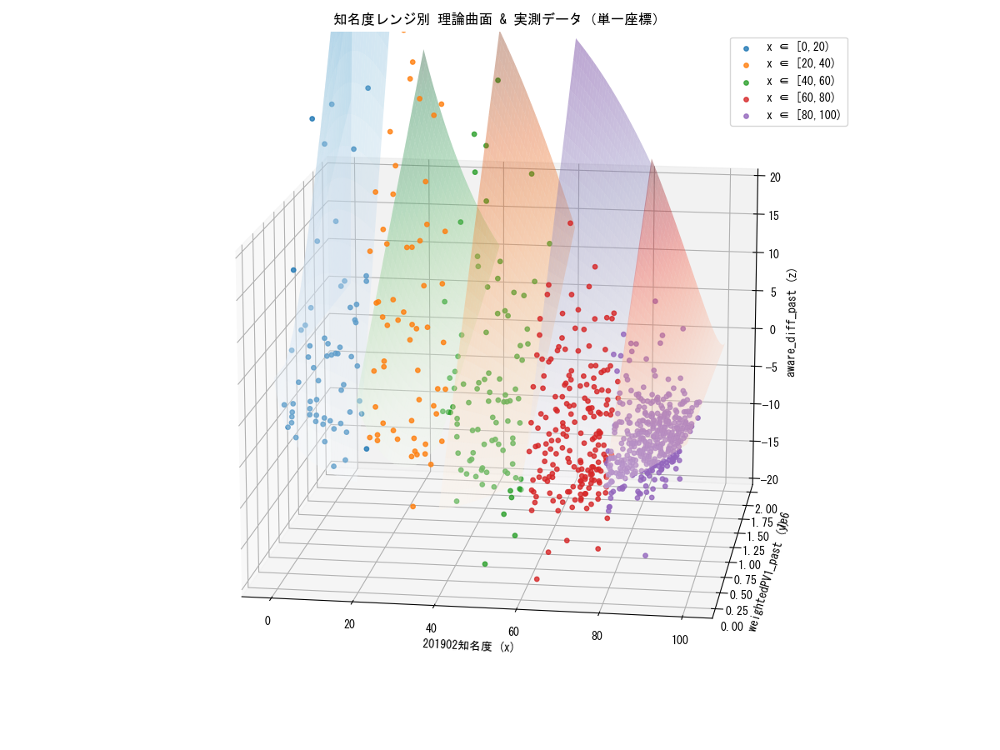

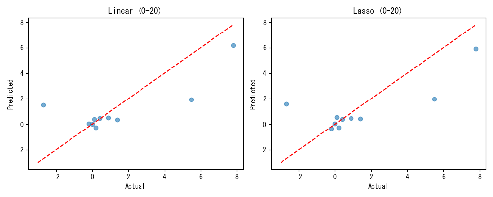
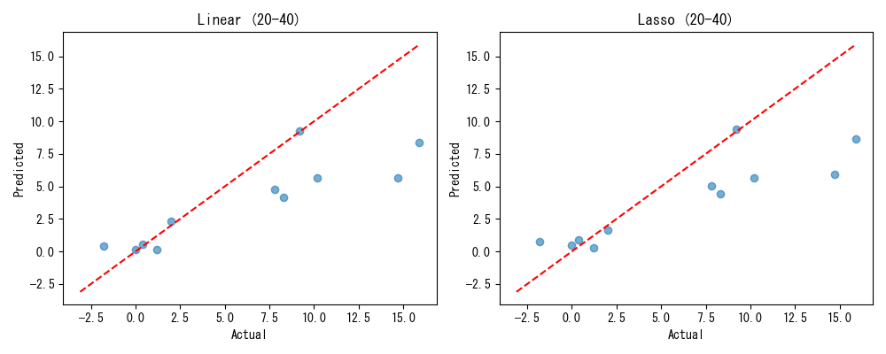
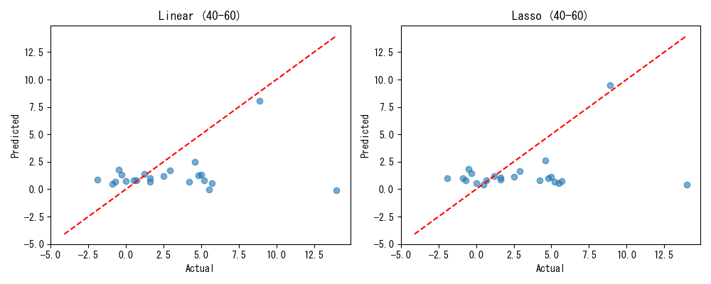
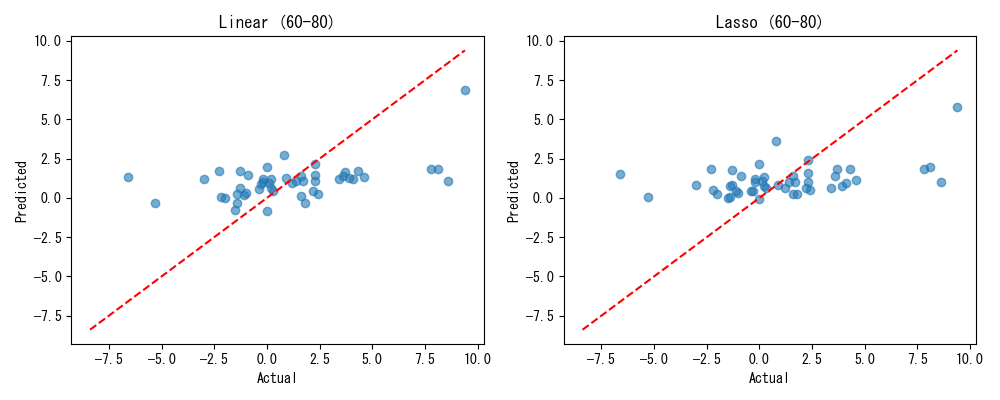
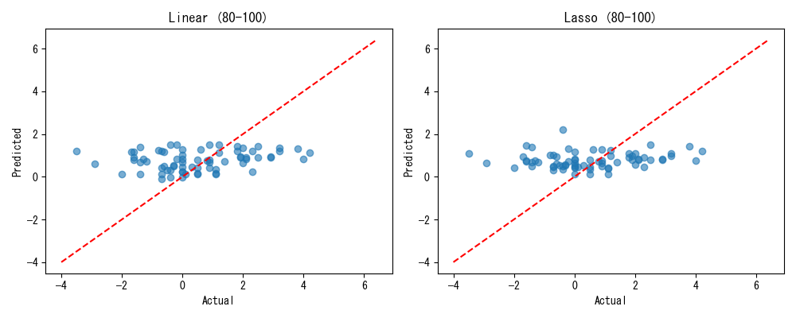

```
============================================================
202208知名度レンジ: 0–20
============================================================
データ数: 47

[Linear Regression]
R2   : 0.5832631584979422
RMSE : 1.8647838749382653
MAPE : 202.91695382976656
MRE  : -201.5075988852437
Coef : [-2.19900076e+00  2.50085703e-02 -4.57304498e-04]
Intercept: 0.5046281247530513

[Lasso Regression]
R2   : 0.5690506056330433
RMSE : 1.8963159352691297
MAPE : 3512.8273867009534
MRE  : -3511.6225363964686
Intercept: -0.33462541987735106
Non-zero Coef:
100-202208知名度::                    -0.353321
log(100-202208知名度)*weightedPV1::    0.019919
(100-202208知名度)*weightedPV1::      -0.000347
dtype: float64

============================================================
202208知名度レンジ: 20–40
============================================================
データ数: 52

[Linear Regression]
R2   : 0.48926937562822903
RMSE : 4.183914963087045
MAPE : 14426.10555476196
MRE  : -14425.279794126627
Coef : [-4.98557410e+01 -1.64420825e-03  1.24065144e-04]
Intercept: 29.81245199427472

[Lasso Regression]
R2   : 0.5193819337894807
RMSE : 4.058699939341521
MAPE : 42928.96115489186
MRE  : -42928.11327870665
Intercept: -0.3281447934153303
Non-zero Coef:
log(100-202208知名度)*weightedPV1::   -0.002733
(100-202208知名度)*weightedPV1::       0.000153
dtype: float64

============================================================
202208知名度レンジ: 40–60
============================================================
データ数: 109

[Linear Regression]
R2   : -0.18548741591119122
RMSE : 3.9486583539092193
MAPE : 34732.482939273694
MRE  : -34730.348742230126
Coef : [ 1.76753817e+01  8.50309550e-03 -2.12598786e-04]
Intercept: -10.22016844012412

[Lasso Regression]
R2   : -0.13222678026470724
RMSE : 3.8589379613300205
MAPE : 24887.658951819114
MRE  : -24885.41618993328
Intercept: -0.3031321047070228
Non-zero Coef:
log(100-202208知名度)*weightedPV1::    0.004223
(100-202208知名度)*weightedPV1::      -0.000064
dtype: float64

============================================================
202208知名度レンジ: 60–80
============================================================
データ数: 240

[Linear Regression]
R2   : 0.23820418557993306
RMSE : 2.79400245271591
MAPE : 59092.75196648669
MRE  : -24014.468946785306
Coef : [-1.47314334e+01 -3.90113213e-03  2.64939220e-04]
Intercept: 5.899734138656822

[Lasso Regression]
R2   : 0.18318674134643564
RMSE : 2.893136212643545
MAPE : 46606.38867283731
MRE  : -42918.38607407458
Intercept: 1.767120351392192
Non-zero Coef:
100-202208知名度::                    -4.687310
log(100-202208知名度)*weightedPV1::   -0.001166
(100-202208知名度)*weightedPV1::       0.000127
dtype: float64

============================================================
202208知名度レンジ: 80–100
============================================================
データ数: 360

[Linear Regression]
R2   : 0.020423174326458127
RMSE : 1.5844360891062306
MAPE : 65653.23200243458
MRE  : -64613.35433842995
Coef : [ 6.39694858e+00  9.91481849e-05 -6.77855392e-06]
Intercept: -0.5052636068940908

[Lasso Regression]
R2   : -0.017867079202812164
RMSE : 1.6151059195336193
MAPE : 69683.05788361399
MRE  : -69680.85139065715
Intercept: 0.424974573286935
Non-zero Coef:
100-202208知名度::                     1.252393
log(100-202208知名度)*weightedPV1::   -0.000974
(100-202208知名度)*weightedPV1::       0.000102
dtype: float64

========== SUMMARY ==========
    range    n    lin_r2  lin_rmse      lin_mape       lin_mre  lasso_r2  lasso_rmse    lasso_mape     lasso_mre
0    0-20   47  0.583263  1.864784    202.916954   -201.507599  0.569051    1.896316   3512.827387  -3511.622536
1   20-40   52  0.489269  4.183915  14426.105555 -14425.279794  0.519382    4.058700  42928.961155 -42928.113279
2   40-60  109 -0.185487  3.948658  34732.482939 -34730.348742 -0.132227    3.858938  24887.658952 -24885.416190
3   60-80  240  0.238204  2.794002  59092.751966 -24014.468947  0.183187    2.893136  46606.388673 -42918.386074
4  80-100  360  0.020423  1.584436  65653.232002 -64613.354338 -0.017867    1.615106  69683.057884 -69680.851391
```

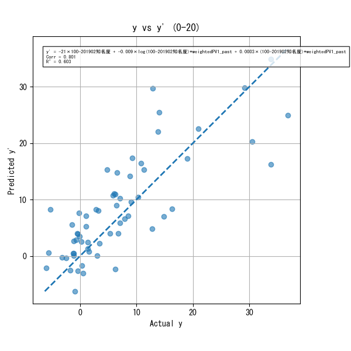
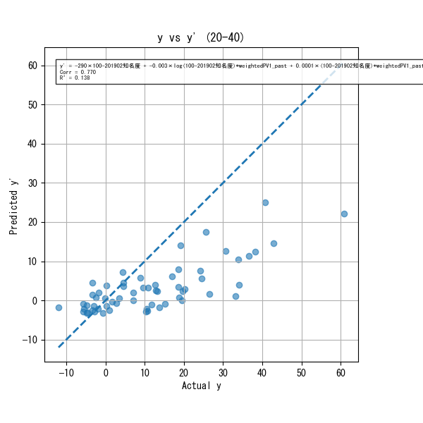
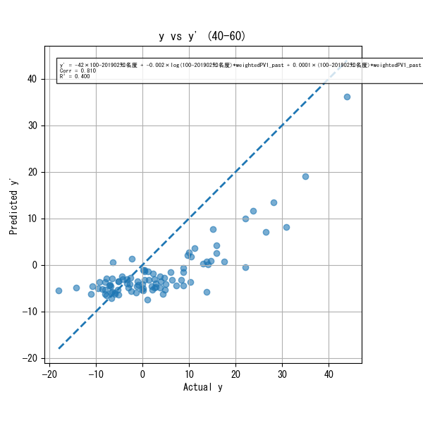
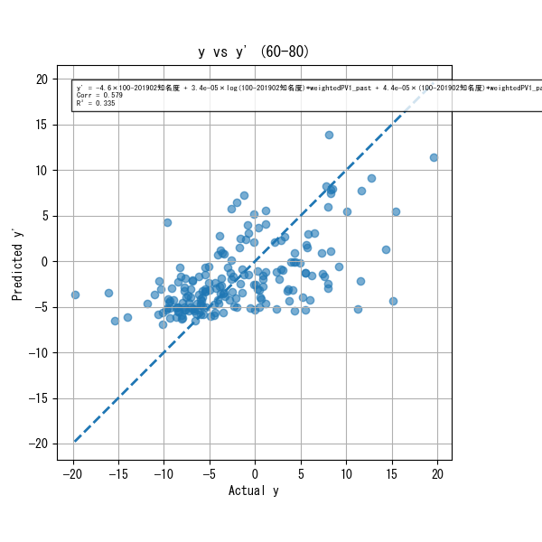
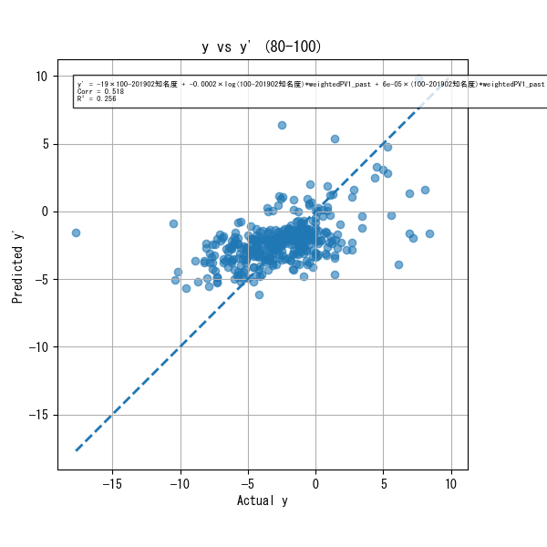

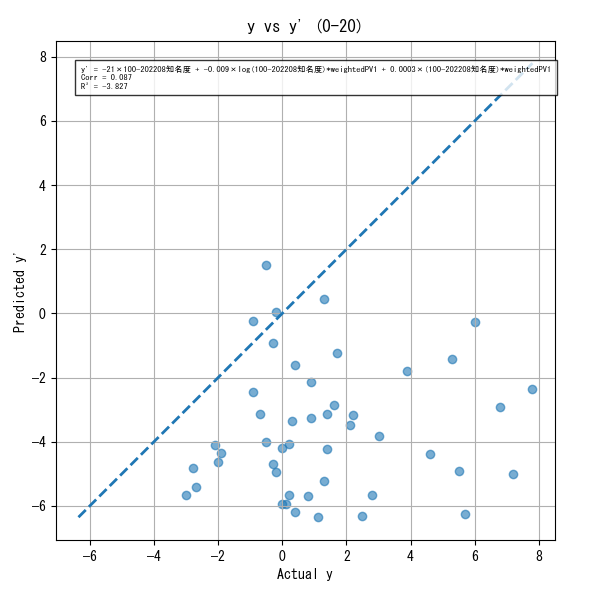
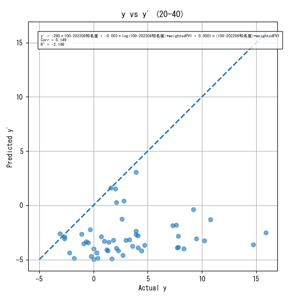
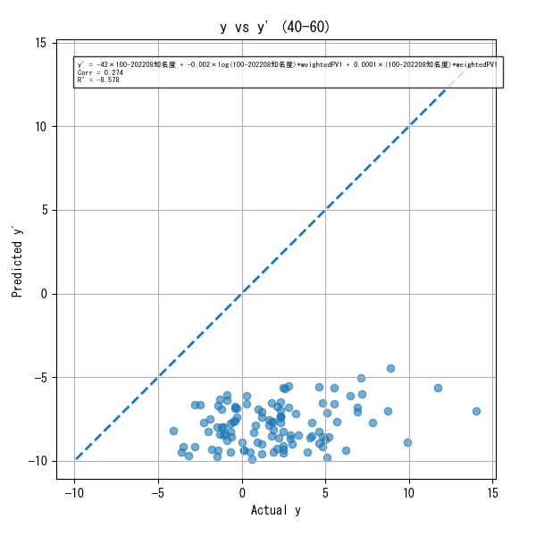
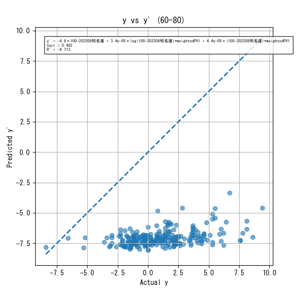
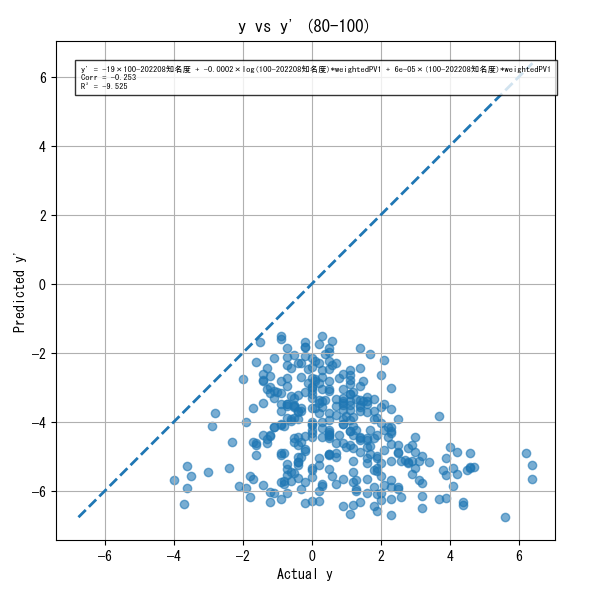

# 性別で分ける

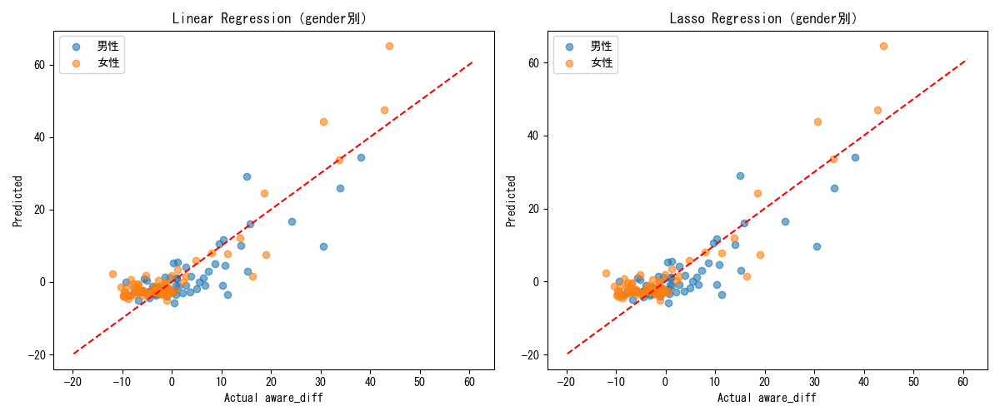

```
========== Linear Regression ==========
Coefficients: [-1.50934322e+01 -9.03908085e-04  9.13303886e-05]
Intercept: -0.011453795781797144
R2: 0.721979288502181
RMSE: 5.191397033981719
MAPE: 32982.04611116044
MRE : 32981.07044255557

========== Lasso Regression ==========
R2: 0.7229493995694984
RMSE: 5.182331823221918
MAPE: 34265.28148323285
MRE : 34264.28394738397
```

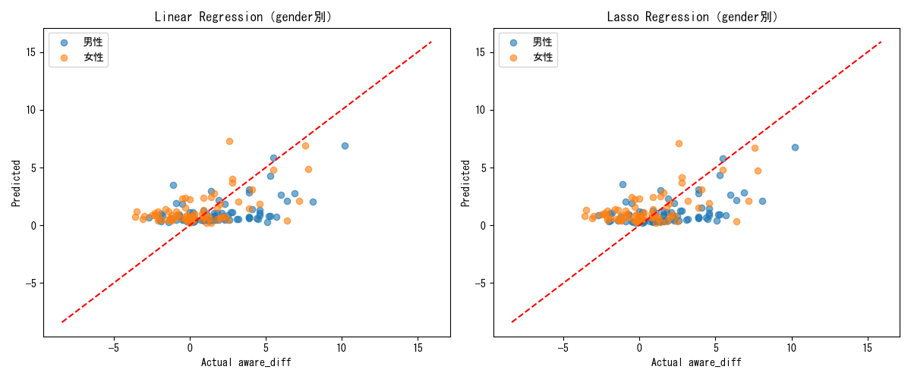

```
========== Linear Regression ==========
Coefficients: [-1.94781275e+00 -1.07248018e-03  1.22708325e-04]
Intercept: 0.7852767813042812
R2: 0.24612939598560424
RMSE: 2.1965588271717804
MAPE: 45697.917203440564
MRE : -45695.866787749816

========== Lasso Regression ==========
R2: 0.2427929992588962
RMSE: 2.2014141040712913
MAPE: 48000.80544178203
MRE : -47998.79423446865
```

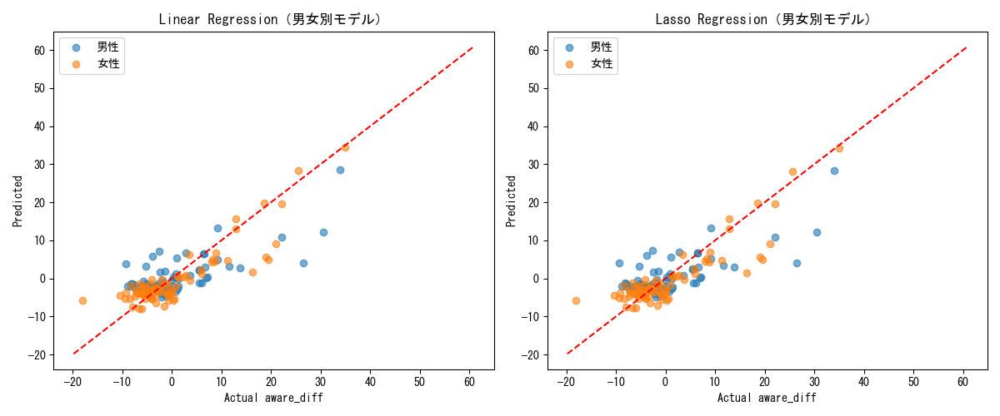

```
====== 男性モデル ======
Linear : {'Coefficients': array([-3.45249314e+00, -8.33101271e-04,  8.38533299e-05]), 'Intercept': -1.5162620893594885, 'r2': 0.5228254019158023, 'rmse': 5.554026324195922, 'mape': 44548.582536650945}
Lasso  : {'r2': 0.5224789832753545, 'rmse': 5.556042011099152, 'mape': 44692.578453549184}

====== 女性モデル ======
Linear : {'Coefficients': array([-2.46306420e+01, -1.08637988e-03,  9.39533456e-05]), 'Intercept': 2.350335104409373, 'r2': 0.7618392778129089, 'rmse': 4.4696647992781395, 'mape': 39412.3511951423}
Lasso  : {'r2': 0.761015165348816, 'rmse': 4.477391357651289, 'mape': 37833.28390289693}
```

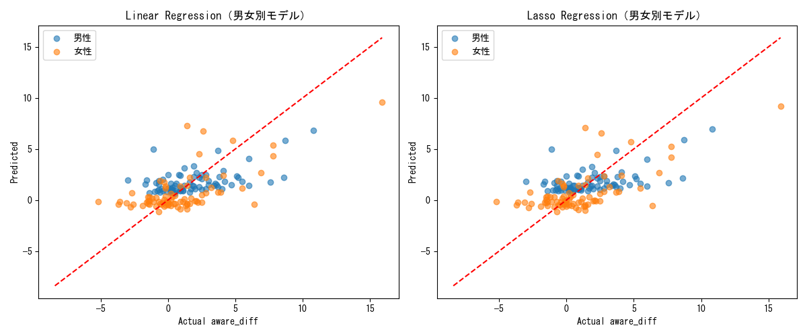

```
====== 男性モデル ======
Linear : {'Coefficients': array([ 9.65128989e-01, -4.61803542e-04,  1.01855897e-04]), 'Intercept': np.float64(0.5854145110843427), 'r2': 0.2635953191076179, 'rmse': np.float64(2.1653743071638334), 'mape': np.float64(46538.13147475103)}
Lasso  : {'r2': 0.2614925395518307, 'rmse': np.float64(2.1684636812002442), 'mape': np.float64(45389.49951006984)}

====== 女性モデル ======
Linear : {'Coefficients': array([-2.07907672e+00, -1.63666931e-03,  1.39943609e-04]), 'Intercept': np.float64(0.09175122432303595), 'r2': 0.4309054449005566, 'rmse': np.float64(2.240431659158522), 'mape': np.float64(17046.505213577962)}
Lasso  : {'r2': 0.427084126417553, 'rmse': np.float64(2.2479410255696806), 'mape': np.float64(17071.791359135786)}
```

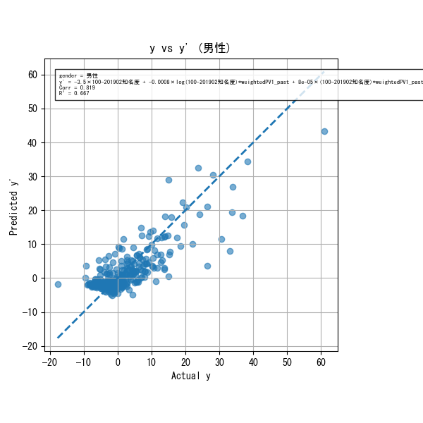
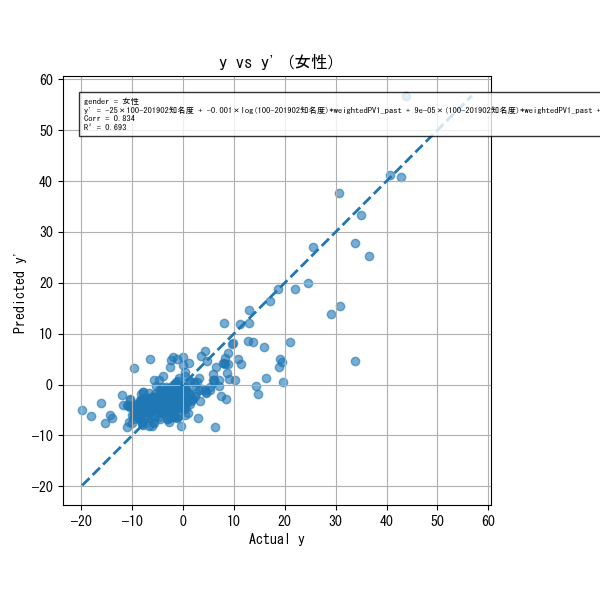
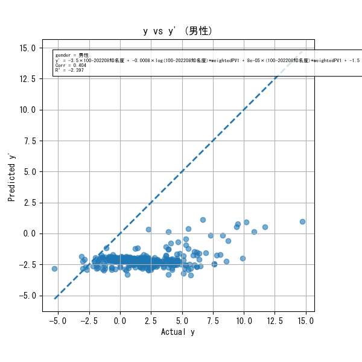
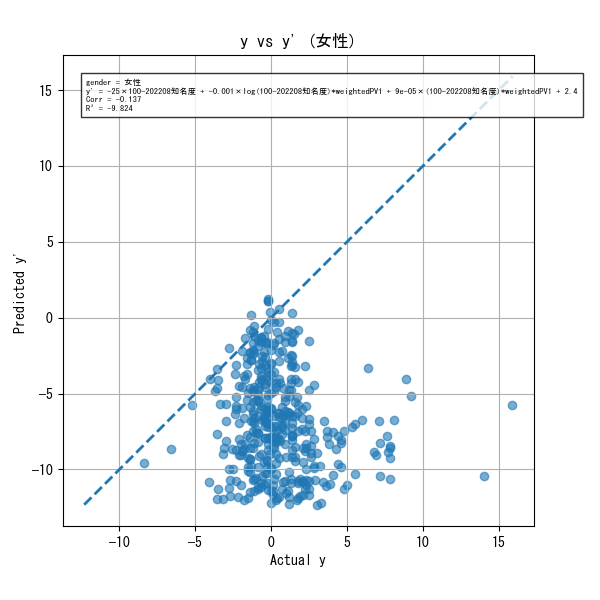

# 形態素解析 → 特徴量生成

##  tf-idfベクトル → 1PVあたり awre_diff の回帰分析

```
===================================
R2 score (test): -9.2697
===================================

--- 1PVあたり awre_diff を押し上げる単語 TOP 30 ---
         word        coef
           隼人 2901.111944
           飲食  863.562710
          可南子  519.655523
            徹  195.669489
           東方  173.307028
        other  171.037732
           役者  161.800924
          幸四郎  155.175249
         クロック  150.504626
           おの  147.238352
            要  143.886260
           re  135.898471
          !!』  122.289180
            茜  116.410226
      episode  114.015730
           めし  113.785078
           福岡  113.124059
           樋口  112.867459
           好き  111.695114
           町田  108.910297
           哲太  105.656502
           小宮  104.425155
          歌舞伎  102.518460
           八木  100.665138
スターダストプロモーション   94.064418
            神   93.997105
           中村   93.354952
           岡本   93.067076
          vol   89.729380
           有岡   89.654730

--- 1PVあたり awre_diff を下げる単語 TOP 30 ---
    word        coef
      年男 -110.314091
     きつね -117.614548
       的 -119.108493
 オダギリジョー -119.864212
      殺人 -120.026879
      部屋 -125.876054
     zip -126.969558
      平泉 -127.151845
      くら -128.260199
       女 -136.016083
      時間 -141.397736
      捕物 -143.597024
      真之 -148.059093
    good -152.673432
handsome -153.452633
      上川 -155.180167
      小田 -159.569434
   サポーター -160.993667
      必殺 -162.475618
      温水 -171.705763
      大知 -175.311994
    歌舞伎座 -175.541618
      丸山 -177.195639
      aw -191.932308
      沢村 -194.187153
       吾 -247.386636
      片寄 -304.510651
      一樹 -336.663635
      キリ -359.909231
      シマ -415.334613
```

##  文章特徴ベクトル[ log_pv, char_len, token_len, noun_ratio, proper_noun_ratio, year_count, katakana_ratio, section_count ] → awre_diff の回帰分析

```
===================================
R2 score (test): 0.1249
===================================

--- 係数（awre_diff への影響）---
          feature          coef
proper_noun_ratio  8.166528e+06
       noun_ratio  7.573781e+06
           log_pv  1.124643e+06
        token_len  2.001630e+02
         char_len -9.126788e+01
       year_count -1.834494e+03
    section_count -2.989237e+04
   katakana_ratio -1.506092e+07
```

## BERT + 構造特徴

### 知名度変化 per PV

```
===================================
R2 score (test): -32.8033
===================================
```

### 知名度変化

```
===================================
R2 score (test): -1.5679
===================================
```

### 知名度 per PV

```
===================================
R2 score (test): -0.6819
===================================
```

### 知名度

```
===================================
R2 score (test): -0.0922
===================================
```

### 人気度変化 per PV

```
===================================
R2 score (test): -0.6070
===================================
```

### 人気度変化

```
===================================
R2 score (test): -1.9726
===================================
```

### 人気度 per PV

```
===================================
R2 score (test): -0.1397
===================================
```

### 人気度

```
===================================
R2 score (test): -0.4141
===================================
```

# 補正の確認

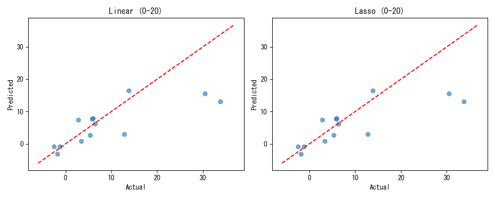
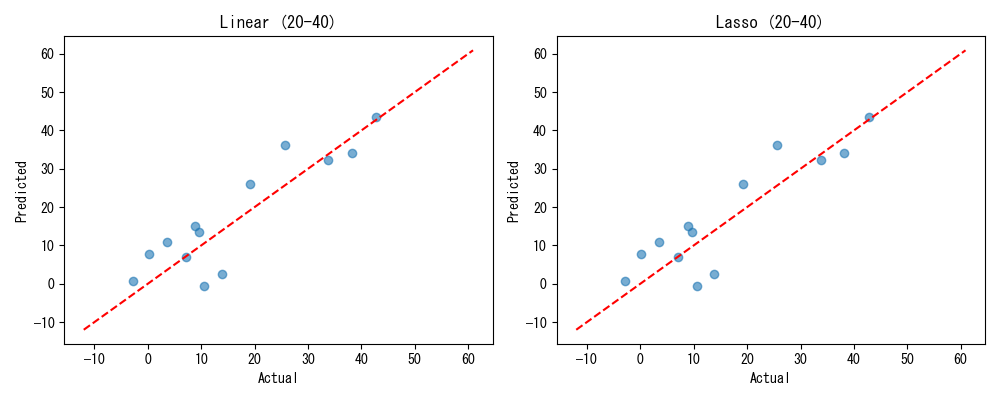
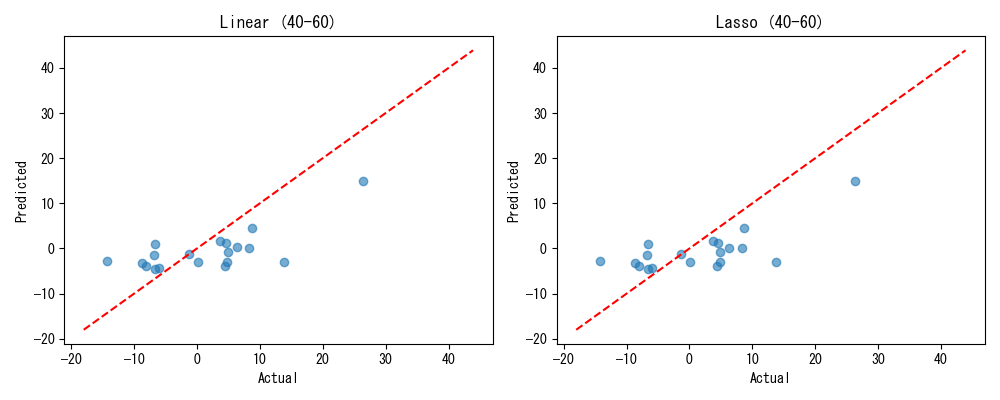
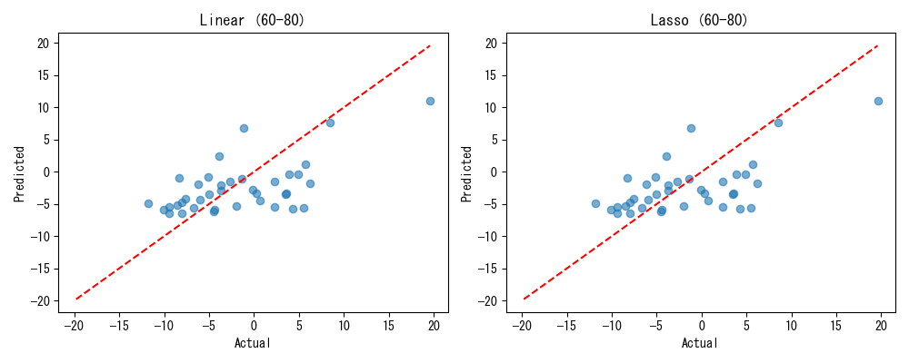
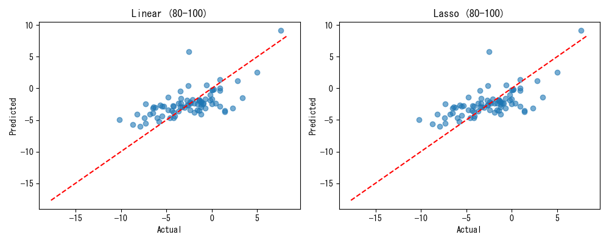

```
============================================================
201902知名度レンジ: 0–20
============================================================
データ数: 62

[Linear Regression]
R2   : 0.4940034510990151
RMSE : 7.834402365954699
MAPE : 0.5613305708493597
MRE  : 0.06596576441047529
Coef : [ 3.06306652e-01  5.45570152e-05 -7.48880406e-07]
Intercept: -32.15457748493055

[Lasso Regression]
R2   : 0.4941422993580604
RMSE : 7.833327390477206
MAPE : 0.5602872702377663
MRE  : 0.065510422910009
Intercept: -32.052477740171135
Non-zero Coef:
100-201902知名度                          3.051697e-01
log(100-201902知名度)*weightedPV1_past    5.438994e-05
(100-201902知名度)*weightedPV1_past      -7.452273e-07
dtype: float64

============================================================
201902知名度レンジ: 20–40
============================================================
データ数: 61

[Linear Regression]
R2   : 0.7667515991556042
RMSE : 6.821841958954086
MAPE : 3.4871924147585345
MRE  : -2.9849654556285765
Coef : [3.38213810e-01 1.46708896e-06 4.37369265e-07]
Intercept: -28.202892854372653

[Lasso Regression]
R2   : 0.7667946730032206
RMSE : 6.821212037061491
MAPE : 3.4858199882679157
MRE  : -2.983673723345597
Intercept: -28.147447071241576
Non-zero Coef:
100-201902知名度                          3.374347e-01
log(100-201902知名度)*weightedPV1_past    1.406877e-06
(100-201902知名度)*weightedPV1_past       4.389208e-07
dtype: float64

============================================================
201902知名度レンジ: 40–60
============================================================
データ数: 93

[Linear Regression]
R2   : 0.39716063254195144
RMSE : 7.234771628020073
MAPE : 2.3905760356080332
MRE  : 2.3905760962991875
Coef : [-1.35512158e-01 -2.83453974e-06  6.42062095e-07]
Intercept: -0.9739754613144807

[Lasso Regression]
R2   : 0.39735446060778035
RMSE : 7.233608453711913
MAPE : 2.391159606212273
MRE  : 2.39115966706443
Intercept: -1.0084919880788727
Non-zero Coef:
100-201902知名度                         -1.348323e-01
log(100-201902知名度)*weightedPV1_past   -2.798440e-06
(100-201902知名度)*weightedPV1_past       6.408627e-07
dtype: float64

============================================================
201902知名度レンジ: 60–80
============================================================
データ数: 190

[Linear Regression]
R2   : 0.35943461861315895
RMSE : 5.107883749909887
MAPE : 2.1665488530091968
MRE  : 0.6422257866188709
Coef : [-4.24007079e-02  6.33855663e-06  3.20973242e-07]
Intercept: -6.873337373322138

[Lasso Regression]
R2   : 0.35952081893061016
RMSE : 5.1075400566450995
MAPE : 2.167588009866484
MRE  : 0.6415874153849019
Intercept: -6.9090832741635975
Non-zero Coef:
100-201902知名度                         -4.118250e-02
log(100-201902知名度)*weightedPV1_past    6.417481e-06
(100-201902知名度)*weightedPV1_past       3.170050e-07
dtype: float64

============================================================
201902知名度レンジ: 80–100
============================================================
データ数: 402

[Linear Regression]
R2   : 0.4194633743795637
RMSE : 2.4120423983612223
MAPE : 54015.664836795106
MRE  : 54014.82944572428
Coef : [-3.00601432e-01 -2.09323042e-06  8.79654590e-07]
Intercept: -1.5054006683446923

[Lasso Regression]
R2   : 0.41944819743181616
RMSE : 2.4120739271232123
MAPE : 54063.86321110466
MRE  : 54063.028076498755
Intercept: -1.516506063273193
Non-zero Coef:
100-201902知名度                         -2.994502e-01
log(100-201902知名度)*weightedPV1_past   -2.048263e-06
(100-201902知名度)*weightedPV1_past       8.750432e-07
dtype: float64

========== SUMMARY ==========
    range    n    lin_r2  lin_rmse      lin_mape       lin_mre  lasso_r2  lasso_rmse    lasso_mape     lasso_mre
0    0-20   62  0.494003  7.834402      0.561331      0.065966  0.494142    7.833327      0.560287      0.065510
1   20-40   61  0.766752  6.821842      3.487192     -2.984965  0.766795    6.821212      3.485820     -2.983674
2   40-60   93  0.397161  7.234772      2.390576      2.390576  0.397354    7.233608      2.391160      2.391160
3   60-80  190  0.359435  5.107884      2.166549      0.642226  0.359521    5.107540      2.167588      0.641587
4  80-100  402  0.419463  2.412042  54015.664837  54014.829446  0.419448    2.412074  54063.863211  54063.028076
```
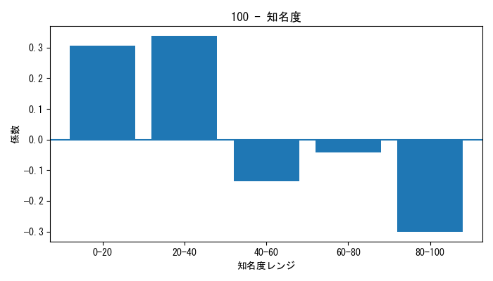
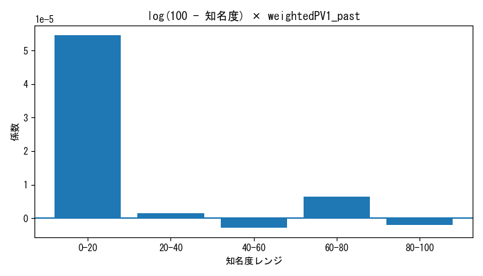
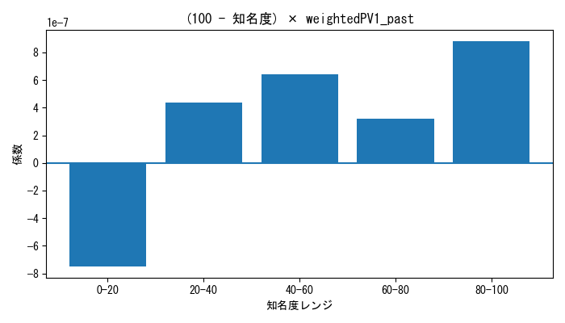
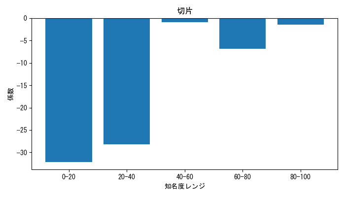

### 202208

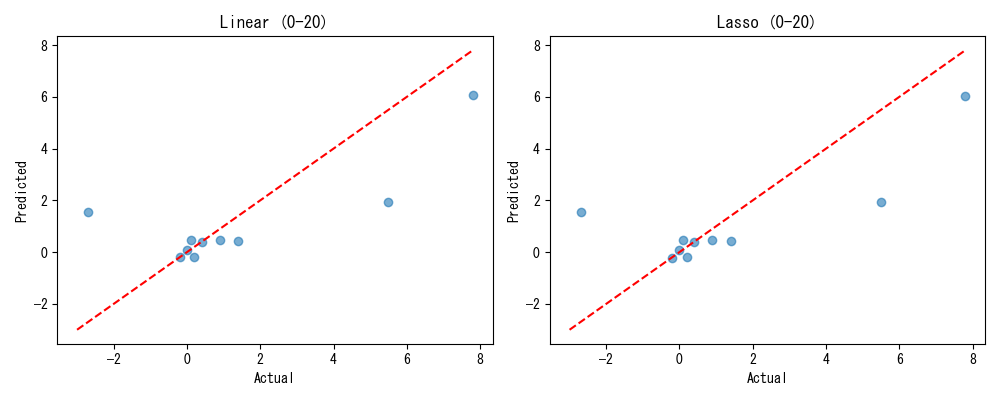
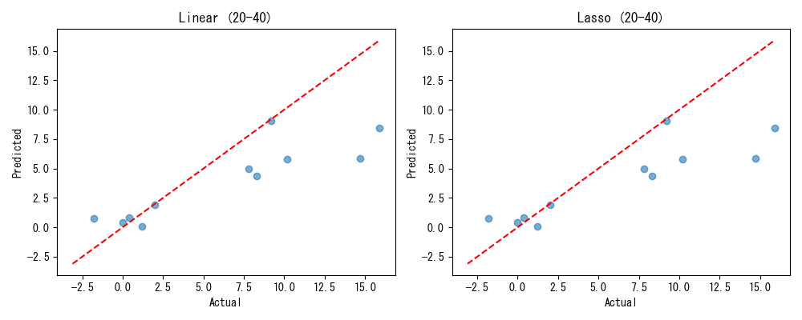

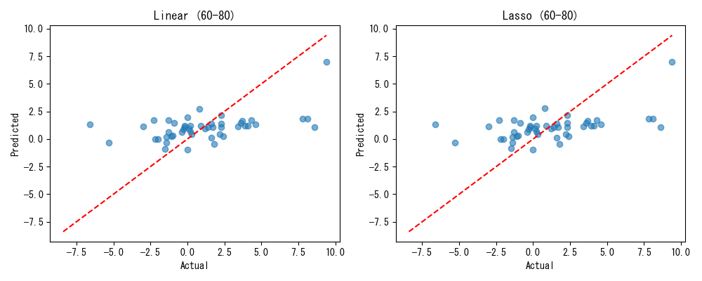
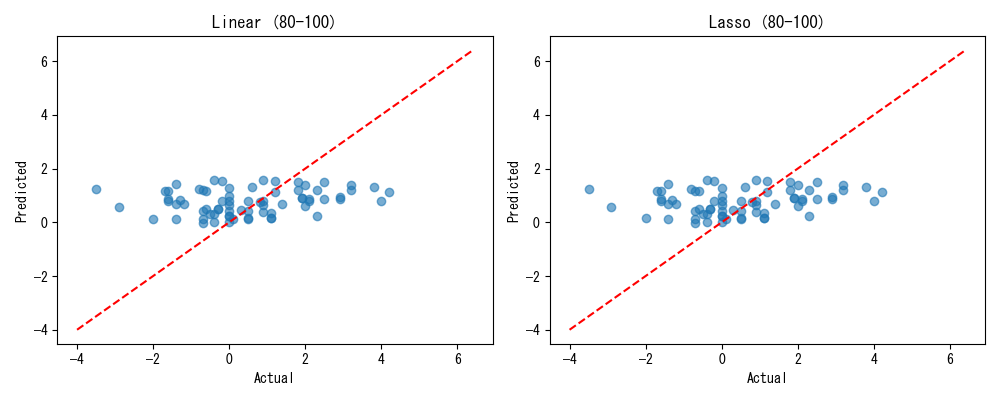

```
============================================================
202208知名度レンジ: 0–20
============================================================
データ数: 47

[Linear Regression]
R2   : 0.580720674249378
RMSE : 1.870463687376339
MAPE : 7829.63934418274
MRE  : -7828.529185569622
Coef : [ 2.64486822e-02  2.49113916e-04 -4.96103743e-06]
Intercept: -2.8472195102773283

[Lasso Regression]
R2   : 0.5801022785890846
RMSE : 1.8718425538867425
MAPE : 7631.671741422065
MRE  : -7630.557078485201
Intercept: -2.743244477278084
Non-zero Coef:
100-202208知名度                     0.025275
log(100-202208知名度)*weightedPV1    0.000248
(100-202208知名度)*weightedPV1      -0.000005
dtype: float64

============================================================
202208知名度レンジ: 20–40
============================================================
データ数: 52

[Linear Regression]
R2   : 0.5088642079178018
RMSE : 4.102869387336777
MAPE : 39350.93411081025
MRE  : -39350.07079599929
Coef : [ 4.72382480e-02  4.04917617e-05 -3.84083521e-07]
Intercept: -3.609296475692659

[Lasso Regression]
R2   : 0.5089279619488758
RMSE : 4.102603083235258
MAPE : 39396.92382059279
MRE  : -39396.06100295015
Intercept: -3.5317055090000817
Non-zero Coef:
100-202208知名度                     4.611765e-02
log(100-202208知名度)*weightedPV1    3.977102e-05
(100-202208知名度)*weightedPV1      -3.648340e-07
dtype: float64

============================================================
202208知名度レンジ: 40–60
============================================================
データ数: 109

[Linear Regression]
R2   : -0.18922899630527779
RMSE : 3.954884731099235
MAPE : 32726.339758699814
MRE  : -32724.216939929036
Coef : [ 8.64417552e-02  1.19233384e-04 -3.17701252e-06]
Intercept: -4.627115623482242

[Lasso Regression]
R2   : -0.1886709667388895
RMSE : 3.953956734231645
MAPE : 32664.451239892947
MRE  : -32662.327576769167
Intercept: -4.592292665467138
Non-zero Coef:
100-202208知名度                     0.085746
log(100-202208知名度)*weightedPV1    0.000119
(100-202208知名度)*weightedPV1      -0.000003
dtype: float64

============================================================
202208知名度レンジ: 60–80
============================================================
データ数: 240

[Linear Regression]
R2   : 0.23897943785923326
RMSE : 2.7925804127880283
MAPE : 61571.137415443634
MRE  : -21097.575391838887
Coef : [-1.44301128e-01 -4.80475221e-05  3.36486781e-06]
Intercept: 4.03573266801626

[Lasso Regression]
R2   : 0.2385822127048013
RMSE : 2.793309130596239
MAPE : 61433.284740747324
MRE  : -21296.03861732352
Intercept: 4.008427490704626
Non-zero Coef:
100-202208知名度                    -0.143362
log(100-202208知名度)*weightedPV1   -0.000048
(100-202208知名度)*weightedPV1       0.000003
dtype: float64

============================================================
202208知名度レンジ: 80–100
============================================================
データ数: 360

[Linear Regression]
R2   : 0.01869112366950798
RMSE : 1.585836240409414
MAPE : 64178.5376488364
MRE  : -64176.411301335465
Coef : [ 9.77385226e-02  1.82430464e-06 -1.23010391e-07]
Intercept: -0.38120836304020744

[Lasso Regression]
R2   : 0.01830982723544128
RMSE : 1.586144305989791
MAPE : 64259.66247609589
MRE  : -64257.534723346485
Intercept: -0.36827774267523394
Non-zero Coef:
100-202208知名度                     9.651340e-02
log(100-202208知名度)*weightedPV1    1.531754e-06
(100-202208知名度)*weightedPV1      -9.386789e-08
dtype: float64

========== SUMMARY ==========
    range    n    lin_r2  lin_rmse      lin_mape       lin_mre  lasso_r2  lasso_rmse    lasso_mape     lasso_mre
0    0-20   47  0.580721  1.870464   7829.639344  -7828.529186  0.580102    1.871843   7631.671741  -7630.557078
1   20-40   52  0.508864  4.102869  39350.934111 -39350.070796  0.508928    4.102603  39396.923821 -39396.061003
2   40-60  109 -0.189229  3.954885  32726.339759 -32724.216940 -0.188671    3.953957  32664.451240 -32662.327577
3   60-80  240  0.238979  2.792580  61571.137415 -21097.575392  0.238582    2.793309  61433.284741 -21296.038617
4  80-100  360  0.018691  1.585836  64178.537649 -64176.411301  0.018310    1.586144  64259.662476 -64257.534723
```

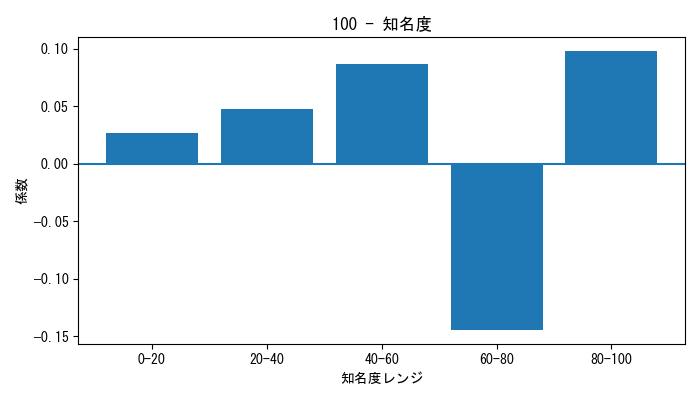
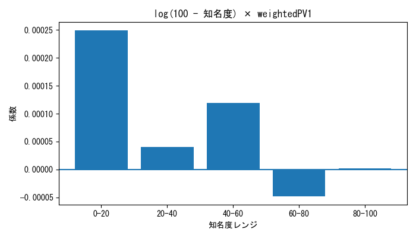
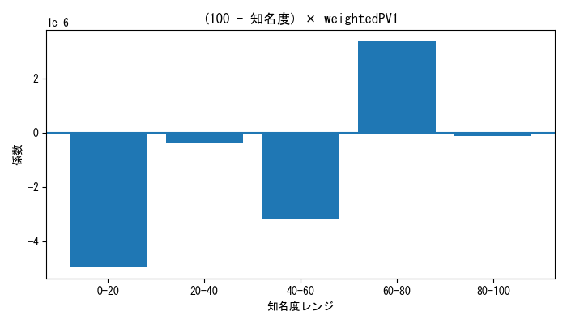
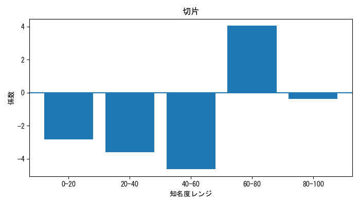

